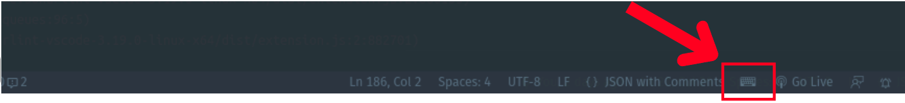

# VSCode Keysound Extension

The VSCode Keysound Extension is a powerful tool that enables mechanical keyboard experience and harmonize your Visual Studio Code keyboard.

## Usage

To use the Keysound Extension, follow these steps:

1. **Install the Extension**: Open the Extensions view in VS Code by pressing `Ctrl+Shift+X` (Windows/Linux) or `Cmd+Shift+X` (Mac). Search for the extension by name, "keysound", and click on "Install" to install it.

2. **Open a file or create a new one in Visual Studio Code**.

3. Start typing and feel the sensation of the sound of the mechanical keyboard.

**Note**: Keysound runs well on linux if on another os there is a problem you please create an [issues](https://github.com/otnansirk/vscode-keysound-extension/issues).

## Configuration Options

The "keysound" configuration allows you to customize the sound settings for various keyboard actions in the VS Code extension. You can enable or disable the sound and specify custom audio files for different actions.

To configure the "keysound" settings, follow the instructions below.

- `keysound.enabled` Set the value of this option to true if you want to enable the sound for keyboard actions. If set to false, the sound will be disabled.
- `keysound.enter` To change the sound specifically for the enter key, provide the full path to a .wav file as the value for this option.
- `keysound.backspace` If you wish to modify the sound played when pressing the backspace key, specify the full path to a .wav file in the value of this option.
- `keysound.other` You can customize the audio for other keyboard actions by specifying the full path to a .wav file. Replace the default value with the desired audio file path.

### Enable sound

### Disable sound

## Reporting issues

If you encounter any issues, bugs, or have suggestions for improvements, please open an issue on the GitHub repository of the Keysound Extension: [Link to GitHub Issues](https://github.com/otnansirk/vscode-keysound-extension/issues)

Please provide detailed information about the problem you encountered and steps to reproduce it. This will help us investigate and resolve the issue more effectively.

## Contributing

Contributions to the Keysound Extension are welcome! If you would like to contribute, please follow these steps:

1. Fork the repository and clone it to your local machine.
2. Make the necessary changes or additions.
3. Write tests to ensure the new features or bug fixes work correctly.
4. Commit your changes and push them to your forked repository.
5. Create a pull request from your forked repository to the main repository.

Please make sure to follow the coding style and guidelines specified in the repository.

## License

The Keysound Extension is released under the [MIT License](LICENSE). You are free to use, modify, and distribute the extension in accordance with the terms of the license.

    <table>
        <tr>
            <td align="center">
                  
                <small>Logo by Canva</small>
            </td>
        </tr>
    </table>
    Made with ❤️ love

